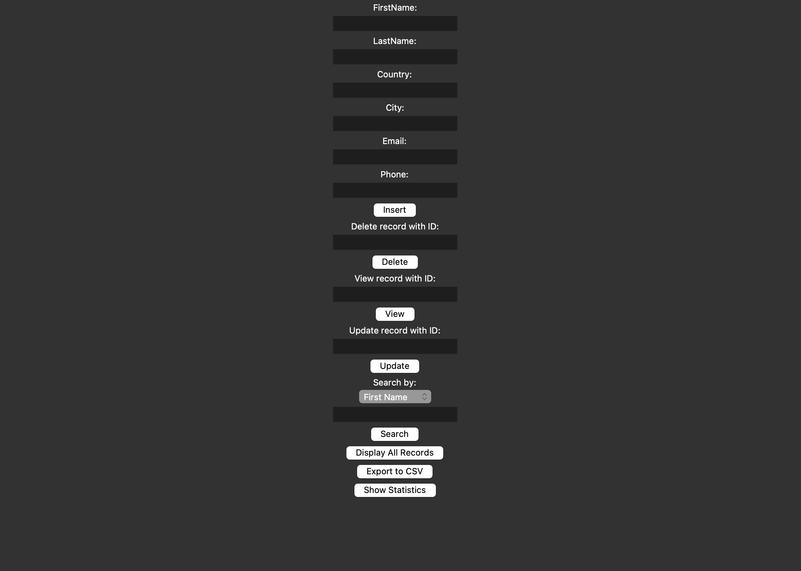

# BasicData - Tkinter Database Editor

A simple database management application built with Python's Tkinter for creating, reading, updating, and deleting (CRUD) records in a SQLite database. It supports additional features like record searching, displaying all records, exporting to CSV, and viewing basic data statistics.

## Features

- **Add New Records**: Input and save user information, including first name, last name, country, city, email, and phone number.
- **Update Existing Records**: Modify existing records by specifying the record ID.
- **Delete Records**: Remove records from the database by ID.
- **Search Records**: Find records by any specified field (e.g., First Name, Last Name, Email).
- **View All Records**: Display all database records in a scrollable window.
- **Export to CSV**: Export all records to a CSV file for easy data sharing.
- **Basic Data Statistics**: View statistics, such as total record count and most common country.

## Installation

1. Clone the repository:

    ```bash
    git clone https://github.com/your-username/BasicData.git
    cd BasicData
    ```

2. Install the required dependencies (Tkinter and SQLite are typically included with Python):

    ```bash
    pip install -r requirements.txt  # if other dependencies are added in future
    ```

3. Run the application:

    ```bash
    python main.py
    ```

## Usage

1. **Adding a Record**: Enter values into each field (First Name, Last Name, Country, City, Email, Phone) and click the **Insert** button to add the record to the database.

2. **Updating a Record**: Enter the **ID** of the record you want to update, along with any updated values for the other fields, and click the **Update** button to modify the record.

3. **Deleting a Record**: Enter the **ID** of the record you wish to delete, then click the **Delete** button to remove the record from the database.

4. **Searching Records**: 
   - Choose a field from the dropdown menu (e.g., First Name, Last Name, Country, etc.).
   - Enter a search term and click the **Search** button to find records that match the search term.

5. **Displaying All Records**: Click the **Display All Records** button to view all entries in the database in a scrollable window.

6. **Exporting to CSV**: Click the **Export to CSV** button to save all records to a CSV file. A file dialog will open, allowing you to choose where to save the file.

7. **Viewing Statistics**: Click the **Show Statistics** button to see basic statistics about the data, such as the total number of records and the most common country.

## Screenshots


## Project Structure

```plaintext
BasicData/
│
├── main.py             # Main application file to run the Tkinter interface
├── insert.py           # Handles adding new records to the database
├── delete.py           # Handles deletion of records by ID
├── update.py           # Handles updating existing records
├── search.py           # Enables searching records by specified fields
├── display_all.py      # Displays all records in a scrollable view
├── export.py           # Exports all records to a CSV file
├── data_statistics.py  # Shows statistics of the data
├── fields.py           # Defines the input fields for the GUI
├── README.md           # Project information and instructions
└── example.db          # SQLite database file (created at runtime if not exists)

## Usage

1. **Adding a Record**: Enter values into each field (First Name, Last Name, Country, City, Email, Phone) and click the **Insert** button to add the record to the database.

2. **Updating a Record**: Enter the **ID** of the record you want to update, along with any updated values for the other fields, and click the **Update** button to modify the record.

3. **Deleting a Record**: Enter the **ID** of the record you wish to delete, then click the **Delete** button to remove the record from the database.

4. **Searching Records**: 
   - Choose a field from the dropdown menu (e.g., First Name, Last Name, Country, etc.).
   - Enter a search term and click the **Search** button to find records that match the search term.

5. **Displaying All Records**: Click the **Display All Records** button to view all entries in the database in a scrollable window.

6. **Exporting to CSV**: Click the **Export to CSV** button to save all records to a CSV file. A file dialog will open, allowing you to choose where to save the file.

7. **Viewing Statistics**: Click the **Show Statistics** button to see basic statistics about the data, such as the total number of records and the most common country.
